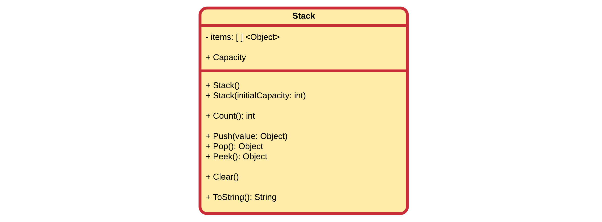

# CSharp Challenge - Dynamic Array

In this challenge we will be creating our own dynamic array collection, similar to what is provided in the .NET framework. Through composition and inheritance different types will be provided suiting the users storage needs.

To lay the foundation for these collection classes, a dynamic array class will first need to be built. This class should be able to store an arbitrary amount of values of type Object. This will allow any type to be stored in the dynamic array.

## Dynamic Array

Start by implementing the `DynamicArray` class:


This class can store any data type that is an Object. Important to note is that internal array has a given size that may not be sufficient at a certain point. This means that once the array is too small, its size should be doubled. Since C# does not allow to resize a basic array, a new one will need to be created. Then all existing elements from the original array need to be copied to the new array.

**Attributes and Properties:**

* `items` is an array of `Object` which is created with a pre-defined size of `8`.
* `Capacity` is a read-only property that returns the length of the internal array.

**Methods:**

* `DynamicArray()` is the default constructor and should only initialize the internal array to a new object of a pre-defined size.
* `DynamicArray(initialCapacity: int)` is a constructor that allows the instantiation of a `DynamicArray` with a given initial capacity. This basically overrules the default capacity of `8`.
* `Count()` counts the actual number of populated array elements. So `null` is not token into account.
* `Add(value: Object)` adds an element to the internal array in the first available spot. If the array is full, the size of the array needs to be doubled and elements need to be copied from the original array to the new array.
* `Insert(index: int, value: Object)` allows adding an element to any `index` inside the array. Important to note is that if the index lies outsize the boundaries of the array, the array needs to be sized to fit the new element at the given index. If an element is already present at the given `index`, it should be replaced.
* `Remove(index: int): Object` removes an object from the array at the given `index` and returns the given `Object`. The element in the array is then set to `null`. If the `index` lies outside the array boundaries, the method should return `null` for the moment being.
* `Peek(index: int): Object` returns the object at the given `index` but does not remove it from the array. If the `index` lies outside the array boundaries, the method should return `null` for the moment being.
* `Clear()` resets all elements in the array to `null`. It does not resize the internal array.
* `Optimize()` moves all elements towards the start of the array so no empty slots are left. It also resizes the array so it only uses the space required to store all the elements. Basically `[ null, 1, 2, null, null, 3, null]` becomes `[ 1, 2, 3 ]`.
* `ToString(): String` returns a nice textual representation of the array by calling the `ToString()` method of all elements or `null` if slot is empty.

`ToString(): String` output:

```
DynamicArray:
[
  0: Nico De Witte
  1: null
  2: null
  3: Dennis The Menace
  4: null
  5: Bart Simpson
  6: null
  7: null
  8: null
] Capacity (8) | Count (3)
```

## Creating a Stack class

A stack is an array or list structure used in modern computer programming and CPU architecture. Similar to a stack of plates at a buffet restaurant or cafeteria, elements in a stack are added or removed from the top of the stack, in a "last in first, first out" or LIFO order.


The process of adding data to a stack is referred to as a "push", while retrieving data from a stack is called a "pop".

Create a class `Stack` that models this kind of behavior.



### Your Approach

**Explain here how you approached this problem. How have you solved this. Do you see any problems with this approach?**

<!-- TODO - Make Remove() throw exception of index is out of bound -->
<!-- TODO - Make Peek() throw exception of index is out of bound -->
<!-- TODO - Use generics instead of Object - https://stackoverflow.com/questions/3049072/template-function-in-c-sharp-return-type -->

## Getting Repo Updates

```bash
git remote add base git@github.com:vives-introduction-to-programming-2020/csharp-dynamic-array.git
git pull --allow-unrelated base master
```
